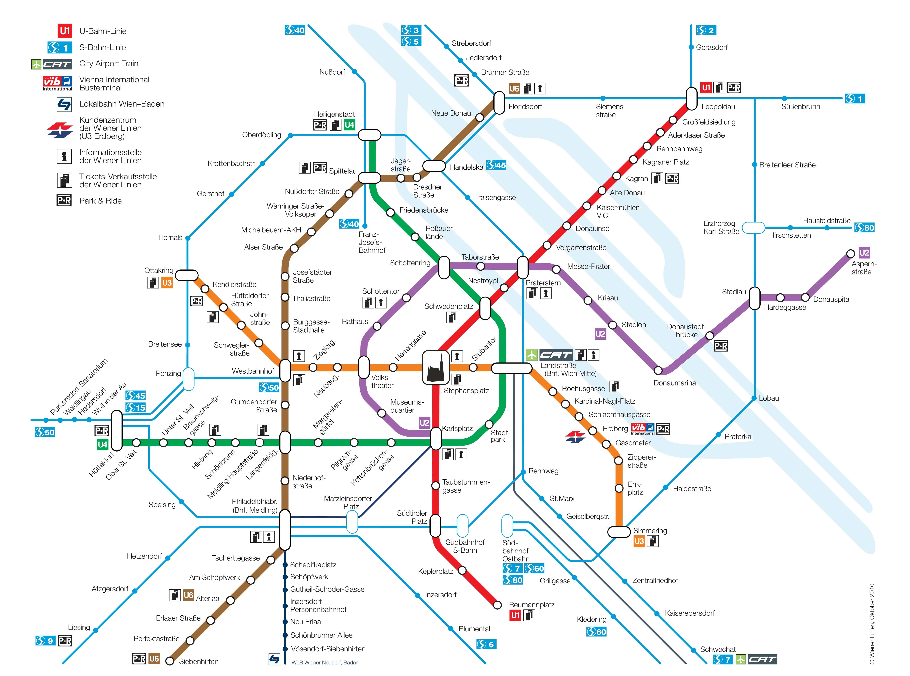

# Ausztria 

Teendők / tartalomjegyzék:

- ~~[munka](#munka)~~
- ~~[tömegközlekedés](#tomegkozlekedes)~~
- [lakás](#lakas)
- [meldezettel](#meldezettel)
- [bank](#bank)
- [mobil](#mobil)
- [biztosítás](#biztositas)
- [anmeldebescheinigung](#anmeldebescheinigung)
- [ecard](#ecard)
- [hauptwohnsitzmeldung](#hauptwohnsitzmeldung)
- [ügyintézés](#ugyintezes)
- [támogatások](#tamogatasok)
- [állampolgárság](#allampolgarsag)
- [tippek](#tippek)
- [kérdések](#kerdesek)
- [linkek](#linkek)

## Munka 

[Bécsi Magyarok](https://www.facebook.com/groups/274342695979311/) - Fb csoport

[English Speakers in Austria](https://www.facebook.com/groups/austria.english.speakers) - Fb csoport

[Jobs für Softwareentwickler und Webdesigner](https://www.facebook.com/groups/webentwickler.jobs/) - Fb csoport

[https://jobs.ams.at/public/emps/](https://jobs.ams.at/public/emps/)

[https://www.karriere.at](https://www.karriere.at)

[https://www.itstellen.at](https://www.itstellen.at)

[https://www.apsa.at/en/job-market/](https://www.apsa.at/en/job-market/)

[Austria, Vienna, Wien, IT, Startup, Österreich, Gründer, Founders](https://www.facebook.com/groups/startup.austria/)

[Job in Austria](https://www.facebook.com/groups/2262445737409292/) - Fb csoport

**[Sportradar](https://sportradar.com) interview! Coding challenge! Felvettek!**

[Fel ↑](#top)

## Tömegközlekedés 

Na ez Bécs egyik legnagyobb előnye. Nincs szükség autóra Bécsben, hacsak nem valamit szállítani akarsz. A tömegközi, vagy bicikli jól működnek. Ha havi bérlet kell azt hiszem 50 Euró, ha éves bérletet veszel, az havi kiosztásban kb 33 Euróra jön ki. (lehet havonta is fizetni, és le is lehet mondani.) Ha az ember hallgató, v fiatal, akkor még jobb lehetőségek is vannak.

Ha vonatozni akartok, Ausztria kicsit drágább, mint Mo, de van egy ún. Vorteilskarte akció, amivel 50% kedvezménnyel utazhat az ember, ha van ilyen kártyája. (19 Euró 1 évben.) Mo-ra utazni a Mávval érdemes, mert olcsóbb 

bécsi tömegközi bérlet. Mert ide is regisztrálni kell, kb egy igazolvány amivel utazhatsz:

https://www.wienerlinien.at/jahreskarte

(és am mindenre érvényes, ami bécs közig határán belül működik. Vonat és hasonlók is.)

A Jahreskarte-hez is kötelező a kis bélyegkép. Személyesen a wiener lienien-ben elkészítik a kártyát elektronikusan, aztán kipostázzák. Viszont, ha nem telik le a 365 nap és menet közben mondja fel az ember, akkor 20 eurot ki kell fizetni

Van egy KulturPass nevű kártya, amit igényelhetsz a kerületesben lévő Nachbarschaftszentrum-ban. Ha a fizetésed nem éri el az X összeget, akkor lehet igényelni, és ingyen bele lehet vele menni egy csomó múzeumba, színházba, hangversenyre, stb..
[https://www.hungeraufkunstundkultur.at/wien](https://www.hungeraufkunstundkultur.at/wien)

](metro.jpg)

[Fel ↑](#top)

## Lakás 

arra keszulj hogy mindenhol butorozatlan lesz az alberlet

[Provisionsfreie Wohnungen in Wien von Privat ohne Makler](https://www.facebook.com/groups/2016076738427452/) - Fb csoport

[Suche/Biete provisionsfreie Wohnung in Wien](https://www.facebook.com/groups/sucheprovisionsfreiwien/) - Fb csoport

[Provisionsfreie Wohnungen in Wien](https://www.facebook.com/ProvisionsfreiWien) - Fb oldal

Lakaskeresesnel arra figyelj, hogy provision frei-t keress, kulonben a kozvetito tobb ezer eurot is elkerhet.

Alapvetoen az iroda a 22. keruletben van es amugy is itt van a legtobb uj epitesu epulet…talan megeri erre keresgetni.

Facebook Marketplace egy lehetőség, sokan használják, főleg külföldiek. A másik oldal: Willhaben. Ez kb az osztrák Jófogás. Itt érdemes lakásokat böngészni. Meg am használtan bármit is lehet itt találni. Esetleg még ez: https://www.immobilienscout24.at/

Lehetséges lakás:

[https://www.google.com/maps/@47.4512643,19.1516624,14z?q=kohlenrutschen+6%2F24](https://www.google.com/maps/@47.4512643,19.1516624,14z?q=kohlenrutschen+6%2F24)  
márciustól  
900-950 eur  
49nm2  
vonatállomás  
7m2 tároló  
parkolás  
tulaj rendes, Dubajban lakó Szlovák
20-40 eur parkolás  
\+ hűtő, mosogató gép, sütő  
\- mosógép

[Fel ↑](#top)

## Meldezettel 

> Feltétel: [lakás](#lakas)

Amikor van mar lakas es szerzodes, akkor be kell menned a hivatalba es ki kell kerned a Meldezettelt. (Igazolas van lakcimed)

[https://www.wien.gv.at/amtshelfer/dokumente/verwaltung/meldeservice/anmeldung.html](https://www.wien.gv.at/amtshelfer/dokumente/verwaltung/meldeservice/anmeldung.html)

Ausztriában **3 napon belül személyesen vagy postai úton be kell jelenteni a lakcím létesítését** *(Meldepflicht)*, a lakcím megváltozását, valamint további lakcímek létesítését vagy megszüntetését *(ideiglenes vagy második lakcím)*. A kitöltött formanyomtatvány az ún. Meldezettel, melyet a szállásadó ír alá. Minden egyes családtagnak külön igazolással kell rendelkeznie. A lakcím bejelentkezése, módosítása vagy megszüntetése Bécsben a Meldeservice irodáiban (**[www.wien.gv.at/verwaltung/meldeservice/stellen.html](https://www.wien.gv.at/verwaltung/meldeservice/stellen.html)**) vagy a Kerületi Elöljáróságokon (*Bezirkshauptmannschaft)* történik.

A lakcím bejelentés a következő.

El kell menni egy hivatalba, ahol be kell ezt "jelenteni". Van egy formanyomtatvány, úgy nevezik, hogy Meldezettel, amit előre ki kell tölteni, szállásadóval aláíratni (ha te vagy a főbérlő, akkor a házvezetés (Hausverwaltung) írja alá. A hivatlban meg az a cél, hogy ők ezt lepecsételjék. Ezt a papírt nem árt, h az ember lefotózza, beszkenneli, hogy digitális formában is meglegyen. (Bankban számlanyitáskor, telefonszámla nyitáskor, munkavállaláskor szokták kérni.) A hivatalban 2-3 héttel előre kell időpontot foglalni (legalábbis nálam így volt). Itt tudsz időpontot foglalni: [https://www.wien.gv.at/verwaltung/meldeservice/stellen.html](https://www.wien.gv.at/verwaltung/meldeservice/stellen.html) -> Online Terminreservierung -> és kiválasztod, h melyik kerületben. A formanyomtatványt meg itt tudod letölteni: [https://www.oesterreich.gv.at/dam/jcr:38f0c638-c65a-4d06-98fe-ac4171607a3a/meldezettel.pdf](https://www.oesterreich.gv.at/dam/jcr:38f0c638-c65a-4d06-98fe-ac4171607a3a/meldezettel.pdf)

 [Lakcím létesítése (Meldepflicht)](https://www.ausztriaimunkak.eu/ausztria-info/lakcim-letesitese-meldepflicht)

[Fel ↑](#top)

## Bank 

> Feltétel: [meldezettel](#meldezettel)

En a Bank99 -nel bankolok, mert nincs semmifele kezelesi koltseg. (Csak a hitelkratlyanal….de arra pedig Revolut-ot hasznalok)

[https://bank99.at/konto/kostenloses-girokonto](https://bank99.at/konto/kostenloses-girokonto)

(Online is lehet nyitni)

Én BankAustria-nál vagyok (ez az otthoni Unicredit megfelelője), havi kb 3 Euró a számlavezetési díjam. Ide kapom a fizut, amúgy PayPalt, meg Revolutot használok mindenre. Másik lehetőség az Erste, nincs vele tapasztalatom, hallottam jót is rosszat is.

Ausztriában csak osztrák bankszámlára utalnak.

Kint nem ugy mukodik mint otthon hogy tok mindegy honnan fizetsz csak fizess credit score rendszer van.

[Fel ↑](#top)

## Mobil 

> Feltétel: [meldezettel](#meldezettel)

Mobilra pedig a Magentat hasznalom (Azert jo, mert nem kell evekre alairni, olcso es jo a lefedettseg)

[https://www.magenta.at/handytarife/wertkarte](https://www.magenta.at/handytarife/wertkarte)

Van Telekom, van "A1", meg minden más, ami az ő hálózatukat használja. Én a "Yesss!"-nél vagyok. Nekik nincs irodájuk, ahova besétál az ember, minden online van (tudtommal). A pénzfeltöltés kicsit körülményes, amúgy a csomagok ár-érték aránya sztem elég jó. Főleg ha sok mobilnet is kell. Mással nincs tapastalatom. 

[Fel ↑](#top)

## Biztosítás 

Biztosításra Sárát "manuálisan" be kell jelenteni, hogy biztosítva legyen! Akkor ő is biztosítva lesz, ha van munkám.

A biztosítást pedig (> Feltételezem) a cég fizeti. Rendelnek majd hozzád egy társadalombiztosítási számot (SV Nummer). Ha ez megvan, akkor el tudnak látni a rendelőben/kórházban.

TB-t is igényelni kell. Ha a munkáltatód nem igényli, akkor neked kell, de ahhoz ki kell kérned egy számot. Az otthoni Tb-t le kell mondani...

[Fel ↑](#top)

## Anmeldebescheinigung 

> Feltétel: [meldezettel](#meldezettel)

Don't forget the Anmeldgebescheinigung, I got fined for lacking it.

Az osztrák idegenrendészeti törvény rendelkezései értelmében azon európai uniós állampolgárok, akik **három hónapnál tovább szeretnének az országban tartózkodni, kötelesek tartózkodásukat a lakóhelyük szerint illetékes önkormányzatnál (Magistrat) bejelenteni**. A bejelentéstől számított három hónapon belül tartózkodási engedély iránti kérelmet kell benyújtaniuk (Anmeldebescheinigung für EWR-BürgerInnen). A bejelentés elmulasztása közigazgatási szabálysértési bírságot von maga után. A tartózkodási engedély feltétele: lakhatás, betegbiztosítás, megélhetés bizonyítása, valamint kitétel még, hogy nem veszélyeztethetik jelenlétükkel az ország közrendjét és közbiztonságát. A fenti tartózkodási engedély birtokában fényképes igazolványt (Lichtbildausweis für EWR-BürgerInnen) lehet kérvényezni, amely személyazonosításra szolgál, érvényessége pedig 10 év.

Ha a Meldezettel meg van, akkor egy honapod van hogy megcsinaltasd az Anmeldebescheinigung-ot (Igazolas hogy eletvitelszeruen itt elsz)

Ez kb 60-70 euro lesz per fo. (2022)

[https://www.wien.gv.at/amtshelfer/dokumente/aufenthalt/ewr/bescheinigungen/arbeitnehmer.html](https://www.wien.gv.at/amtshelfer/dokumente/aufenthalt/ewr/bescheinigungen/arbeitnehmer.html)

Amikortól a lakcímedet bejelentetted, 4 hónapod van a bevándorlási hivatalban is bejelenteni, h bizony tartósan itt akarsz lakni. Ha ezt nem teszed meg, annak elvileg lesz következménye (anyagi), de hogy mi és mennyi fogalmam sincs. Meldezettelnél adnak pontos infókat, hogy hogyan kell ezt csinálni.

Anmeldebescheinigung 30EUR, és csak bevándorlási hivatalban csináltathatod, és nem jó hozzá a személyi igazolvány, útlevél kell, lefénymásolva. És minden esetben 4 hónapod van rá, nem csak egy. 4 hónap után automatikusan csendben gyűlik a havi büntetés, és 1-2 év múlva kiszámláznak neked több ezer eurót

[Fel ↑](#top)

## Ecard 

> Feltétel: [meldezettel](#meldezettel)

Nem árt, ha van egy ún ecardod a biztosítások kívűl, ami kb egy tajkártya, csak sokkal körülményesebb, meg hivatalosabb. Kell majd hozzá egy (igazoltan 6 hónapnál nem idősebb igazolványfotó), ami mint egy vízumfotó, bizonyos követelményeknek eleget kell, hogy tegyen. Ezt sztem Mo-on is el lehet intézni, és bizonyosan olcsóbb, mint itt a sógoréknál. (Itt egységesen 12 Euró minden fotóboxban. )

[https://www.chipkarte.at/cdscontent/?contentid=10007.853312&portal=ecardportal](https://www.chipkarte.at/cdscontent/?contentid=10007.853312&portal=ecardportal&fbclid=IwAR3KlQsWqiqsmALxeuDigBI-oKDW3oV2dH31HdaGM007FixXE6PKcsUdd8E)

itt tudsz majd regisztrálni: -> elektronische Terminvereinbarung, illetve kritériumok: -> Passbildkriterien.

[Fel ↑](#top)

## Hauptwohnsitzmeldung 

[https://www.oesterreich.gv.at/themen/dokumente_und_recht/an__abmeldung_des_wohnsitzes/Seite.1180200.html](https://www.oesterreich.gv.at/themen/dokumente_und_recht/an__abmeldung_des_wohnsitzes/Seite.1180200.html)

[https://www.wien.gv.at/amtshelfer/dokumente/verwaltung/meldeservice/anmeldung.html](https://www.wien.gv.at/amtshelfer/dokumente/verwaltung/meldeservice/anmeldung.html)

[Fel ↑](#top)

## Ügyintézés 

Magyarorszagon is kell majd jelentkezned a rendszebol. Tarsadalombiztositonal kell lejelentened, hogy mar kulfoldon elsz.

Az elso ev vegen mindket orszagban kell adobevallast csinalnod.

[https://finanzonline.bmf.gv.at/fon/](https://finanzonline.bmf.gv.at/fon/)

[Fel ↑](#top)

## Támogatások

A legtöbb támogatást az AMS vagy a WAFF szolgáltatja.
Ahogy csak tudjátok, használjatok ki mindent. Meg a "nem lehet"-nek ne higgyetek, kicsit push-olyi kell a dolgokat. Bár angolul nehéz, mert akkor köcsögök és nem is értik annyira. Vagy nem akarják.

[Fel ↑](#top)

## Állampolgárság 

EU-s állampolgárként 6 év, amúgy 10 év legalább 5 év állandó ottani lakhellyel.

[Fel ↑](#top)

## Tippek 

- A legtöbb dologról kint elő magyaroktól tájékozódtam. Ismerkedjetek sokat, meg van rengeteg ilyen magyarok Ausztriában/Bécsben csoport. Azokba érdemes belépni

[Fel ↑](#top)

## Kérdések 

- GIS re (tv-rádió adó) ?
- Majd érdemes figyelni az egyházi adóra. (Ha beírod, hogy milyen vallású vagy, jon automatikusan.) Pontos osszegeket nem tudok.
- [ID Austria/Handy-Signature/digital driving licence](https://www.englishspeakers.at/post/id-austria-digital-driving-licence?fbclid=IwAR0yh-SnqYQjEn5KjyJabnXsnPqm1k8z3Nfz7rDbZ3CZZUeqXi5m3QsaM_w) ?

[Fel ↑](#top)

## Linkek 

- [EscapeHungary](https://www.reddit.com/r/escapehungary/) - Reddit
- [English Speakers in Austria](https://www.englishspeakers.at)
- [AllAboutVienna](https://allaboutvienna.com/category/moving-to-vienna/)
- [WorkInAustria](https://www.workinaustria.com/en/)
- [Élni és dolgozni Ausztriában](https://becs.mfa.gov.hu/page/altalanos-tudnivalok-az-ausztriaban-letelepedni-munkat-vallalni-szandekozok-szamara) - Bécsi Nagykövetség
- [Anwaltneudoerfler](https://www.facebook.com/anwaltneudoerfler) - Jogi és egyéb jó tanácsok
- [Reddit Rot-Weiß-Rot](https://www.reddit.com/r/Austria/wiki/vienna/) - Reddit Austria wiki
- [Nachrichten über/aus/von Wien](https://www.reddit.com/r/wien/wiki/index/) - Reddit Vienna wiki
- [The ultimate expat career guide to Austria](https://www.facebook.com/groups/austria.english.speakers/posts/1132079424128700/)
- [The Vienna Expat survival guide: 13 ultimate tips for internationals moving to, or living in Vienna](https://www.reddit.com/r/wien/comments/64yhfk/the_vienna_expat_survival_guide_13_ultimate_tips/)
- [Ausztria - finance](https://www.reddit.com/r/escapehungary/comments/10rp8a7/ausztria_finance/) - Reddit post + kommentek
- [Kiköltözés előtti állapot](https://www.reddit.com/r/escapehungary/comments/10jagfp/kik%C3%B6lt%C3%B6z%C3%A9s_el%C5%91tti_%C3%A1llapot/) - Reddit post + kommentek
- [Kiköltözés előtti teendő lista](https://www.reddit.com/r/escapehungary/comments/10hyeuj/kik%C3%B6lt%C3%B6z%C3%A9s_el%C5%91tti_teend%C5%91_lista/) - Reddit post + kommentek
- [Segítség külföldre költözőknek a magyar TB rendezésével](https://www.reddit.com/r/escapehungary/comments/10qt9fl/seg%C3%ADts%C3%A9g_k%C3%BClf%C3%B6ldre_k%C3%B6lt%C3%B6z%C5%91knek_a_magyar_tb/) - Reddit post + kommentek
- [Általános tudnivalók az Ausztriában letelepedni, munkát vállalni szándékozók számára](https://www.facebook.com/legacy/notes/223544387833390/)
- [Külföldi letelepedés bejelentése](https://becs.mfa.gov.hu/page/kuelfoeldi-letelepedes-bejelentese) - Bécsi Nagykövetség
- 

[Fel ↑](#top)